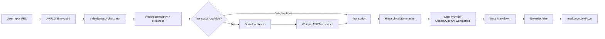

# Silentir

## Overview

Silentir is a Python package that generates structured markdown notes from YouTube and Bilibili videos using local (Ollama) or online (OpenAI-compatible) large language models. It prioritizes subtitle extraction with automatic speech recognition (ASR) fallback when subtitles are unavailable, and supports configurable provider fallback policies for model inference.

## Quick Start

### Install

```bash
uv sync
```

Optional dependencies:
```bash
uv sync --extra asr      # Whisper ASR support
uv sync --extra ui       # Streamlit web UI
uv sync --extra examples # Example dependencies
uv sync --group dev      # Development/test dependencies
```

### Usage (CLI)

```bash
uv run silentir "https://www.youtube.com/watch?v=dQw4w9WgXcQ" \
  --provider-policy local_first \
  --output-format markdown \
  --include-timestamps section \
  --out notes.md
```

### Usage (Python API)

```python
from silentir import generate_notes

result = generate_notes(
    "https://www.youtube.com/watch?v=dQw4w9WgXcQ",
    language="auto",
    provider_policy="local_first",
    local_model="qwen2.5:7b-instruct",
    online_model="gpt-4.1-mini",
    ollama_host="http://localhost:11434",
    openai_base_url="https://api.openai.com/v1",
    openai_api_key=None,
)
print(result.note_markdown)
```

### Run the Web UI

```bash
uv run --extra ui streamlit run examples/basic_ui.py
```

### Run Tests

```bash
uv run pytest
```

## Architecture

Silentir follows a **pipeline architecture** with clear separation of concerns. The entire process is orchestrated by `VideoNotesOrchestrator` which coordinates the following stages:



### Core Components

| Component | Location | Purpose and Responsibility |
|-----------|----------|-----------------------------|
| **VideoNotesOrchestrator** | [`src/silentir/orchestrator.py`](src/silentir/orchestrator.py) | Main pipeline coordinator. Validates configuration, manages fallback strategies, delegates to specialized components. |
| **API Entry Point** | [`src/silentir/api.py`](src/silentir/api.py) | Public Python API (`generate_notes` function) for programmatic use. |
| **CLI Entry Point** | [`src/silentir/cli.py`](src/silentir/cli.py) | Command-line interface with argparse argument parsing. Installed as `silentir` console script. |
| **Recorders** | [`src/silentir/recorders/`](src/silentir/recorders/) | Extract video metadata and subtitles from URLs. Supports YouTube, Bilibili, and local video files. |
| **Transcribers** | [`src/silentir/transcribers/`](src/silentir/transcribers/) | ASR transcription when subtitles are unavailable. Uses faster-whisper with openai-whisper fallback. |
| **Models** | [`src/silentir/models/`](src/silentir/models/) | Abstract chat provider interface with implementations for Ollama (local) and OpenAI-compatible (online) models. |
| **Summarizers** | [`src/silentir/summarizers/`](src/silentir/summarizers/) | Hierarchical summarization: chunks transcript, summarizes each chunk, then merges into final notes. |
| **Noters** | [`src/silentir/noters/`](src/silentir/noters/) | Output rendering in multiple formats (markdown, plain text, JSON). |
| **Types** | [`src/silentir/types.py`](src/silentir/types.py) | Shared dataclasses for segments, transcripts, metadata, and results. |
| **Exceptions** | [`src/silentir/exceptions.py`](src/silentir/exceptions.py) | Custom exception types for error handling. |

## Key Concepts

### Fallback Ladder

Silentir uses a multi-level fallback strategy:

1. **Transcript source**: Subtitles → ASR transcription
2. **Bilibili subtitle backend** (Bilibili URLs only): `bilibili-cli` (`bili`) → `yt-dlp`, controlled by `--bilibili-backend` (`auto` / `bili` / `ytdlp`)
3. **ASR backend**: faster-whisper → openai-whisper
4. **LLM provider**: Follows configured `provider_policy`: `local_first`, `online_first`, `local_only`, or `online_only`

### Provider Policies

- `local_first`: Try local Ollama first, fall back to online model
- `online_first`: Try online model first, fall back to local Ollama
- `local_only`: Only use local Ollama
- `online_only`: Only use online OpenAI-compatible model

### Timestamp Modes

Control how timestamps are included in the generated notes:
- `none`: No timestamps
- `section`: Add timestamps at section boundaries
- `point`: Add timestamps for each bullet point

### Output Formats

- `markdown`: Formatted markdown notes
- `text`: Plain text output
- `json`: Structured JSON output with all metadata

## Directory Structure

```
silentir/
├── src/silentir/                    # Main package
│   ├── __init__.py               # Package exports (generate_notes, NoteResult)
│   ├── api.py                    # Public Python API
│   ├── cli.py                    # CLI entry point
│   ├── orchestrator.py           # Main pipeline orchestrator
│   ├── types.py                  # Shared data structures
│   ├── exceptions.py             # Custom exceptions
│   ├── logging.py                # Logging configuration
│   ├── models/                   # LLM providers
│   │   ├── base.py               # Base ChatProvider interface
│   │   ├── ollama_provider.py    # Ollama (local) implementation
│   │   └── openai_compatible_provider.py  # OpenAI-compatible implementation
│   ├── recorders/                # Video metadata/transcript extractors
│   │   ├── base.py               # Base Recorder interface
│   │   ├── youtube.py            # YouTube recorder
│   │   ├── bilibili.py           # Bilibili recorder (bili -> yt-dlp fallback)
│   │   └── file.py               # Local video file recorder
│   ├── transcribers/             # ASR transcription
│   │   ├── base.py               # Base Transcriber interface
│   │   ├── subtitles.py          # VTT subtitle parser
│   │   └── whisper.py            # Whisper ASR transcriber
│   ├── summarizers/              # Summarization pipeline
│   │   ├── chunker.py            # Transcript chunking
│   │   ├── pipeline.py           # Hierarchical summarization
│   │   └── prompts.py            # Prompt construction
│   └── noters/                   # Output rendering
│       ├── base.py               # Base Noter interface
│       ├── markdown.py           # Markdown renderer
│       ├── text.py               # Plain text renderer
│       └── json.py               # JSON renderer
├── tests/                         # Tests
│   ├── conftest.py               # pytest configuration
│   ├── resources/                # Test data
│   ├── test_chunker.py           # Chunking tests
│   ├── test_cli.py               # CLI tests
│   ├── test_file_recorder.py     # File recorder tests
│   ├── test_bilibili_recorder.py # Bilibili recorder tests (bili backend + fallback)
│   ├── test_model_config_validation.py
│   ├── test_orchestrator_policy.py
│   ├── test_renderers.py         # Output rendering tests
│   └── test_subtitles.py         # Subtitle parsing tests
├── examples/                      # Examples
│   ├── basic_usage.py            # Python API example
│   └── basic_ui.py               # Streamlit UI example
├── docs/
│   └── architecture.md           # Detailed architecture documentation
├── skills/
│   └── silentir/                   # Claude Code skill integration
│       ├── SKILL.md              # Skill manifest
│       └── handler.py            # Skill entry point
├── .github/workflows/
│   └── quality.yml               # CI quality checks
├── pyproject.toml                # Project configuration
├── uv.lock                        # uv package lock
└── README.md                      # Project README
```

## Data Flow

1. **Entry**: User provides a video URL via API or CLI
2. **Discovery**: Orchestrator selects a recorder based on URL domain
3. **Transcript Acquisition**:
   - Recorder tries to extract subtitles directly from the platform
   - If no subtitles available: download audio → run ASR → get transcript
4. **Language Resolution**: If language is `auto`, detect from transcript
5. **Provider Selection**: Build provider candidates based on policy
6. **Summarization**:
   - Chunk the transcript into manageable segments
   - Summarize each chunk with the LLM
   - Merge chunk summaries into a final coherent note
   - On failure, try the next provider in sequence
7. **Output**: Render note in requested format and write to file if specified
8. **Return**: Return `NoteResult` with notes, metadata, and warnings

For a detailed flow diagram, see [docs/architecture.md](docs/architecture.md#end-to-end-video-to-note-flow).

## API Reference

### `generate_notes()` Main Entry Point

```python
def generate_notes(
    url: str,
    language: str | None = "auto",
    provider_policy: ProviderPolicy = "local_first",
    local_model: str | None = "qwen2.5:7b-instruct",
    online_model: str | None = "gpt-4.1-mini",
    ollama_host: str = "http://localhost:11434",
    openai_base_url: str = "https://api.openai.com/v1",
    openai_api_key: str | None = None,
    output_format: OutputFormat = "markdown",
    include_timestamps: TimestampMode = "section",
    write_path: str | None = None,
    cookies_path: str | None = None,
) -> NoteResult:
```

### `NoteResult` Dataclass

```python
@dataclass
class NoteResult:
    url: str
    title: str
    language: str
    note_markdown: str
    transcript_source: str
    provider_used: str
    model_used: str
    duration_sec: float | None
    warnings: list[str]
```

## Configuration

All configuration is **explicit** - no implicit configuration from environment variables. Configure via:

- CLI arguments when using the command line
- Function parameters when using the Python API
- See [`pyproject.toml`](pyproject.toml) for project/dependency configuration

### Key Configuration Options

| Option | Description | Default |
|--------|-------------|---------|
| `provider_policy` | Provider preference order | `local_first` |
| `local_model` | Ollama model name to use | `qwen2.5:7b-instruct` |
| `online_model` | OpenAI-compatible model name | `gpt-4.1-mini` |
| `ollama_host` | Ollama API endpoint | `http://localhost:11434` |
| `openai_base_url` | OpenAI-compatible API base URL | `https://api.openai.com/v1` |
| `output_format` | Output format (`markdown`\|`text`\|`json`) | `markdown` |
| `include_timestamps` | Timestamp inclusion mode (`none`\|`section`\|`point`) | `section` |
| `language` | Language code, `auto` for detection | `auto` |
| `write_path` | Path to write output file | `None` |

## Technology Stack

| Layer | Technology | Purpose |
|-------|------------|---------|
| **Language** | Python 3.10+ | Core implementation |
| **Video Download** | yt-dlp | Audio/video extraction from platforms |
| **ASR** | faster-whisper / openai-whisper | Automatic speech recognition with fallback |
| **LLM** | Ollama (local), OpenAI-compatible API | Text summarization |
| **Optional UI** | Streamlit | Web-based user interface |
| **Packaging** | uv, setuptools | Dependency management and packaging |
| **Testing** | pytest | Unit testing |
| **Linting/Formatting** | ruff, pre-commit | Code quality checks |

## Extension Points

Silentir is designed for extensibility:

- **New video platform**: Implement `BaseRecorder` and register in `RecorderRegistry`
- **New ASR engine**: Implement `BaseTranscriber` and inject into `VideoNotesOrchestrator`
- **New LLM provider**: Implement `ChatProvider` and add candidate wiring in orchestrator
- **New output format**: Implement `BaseNoter` and register in `NoterRegistry`
- **New summarization strategy**: Implement `BaseSummarizer` and inject into orchestrator

See [docs/architecture.md](docs/architecture.md#extension-points) for details.

## Code Quality Observations

- **Clear separation of concerns**: Each module has a single responsibility
- **Dependency injection**: Orchestrator accepts mock implementations for testing
- **Explicit configuration**: No hidden defaults from environment
- **Comprehensive unit tests**: Core logic covered by tests
- **Modern Python**: Uses dataclasses, type hints, follows PEP 8
- **CI/CD**: GitHub Actions workflow for quality checks
- **Pre-commit hooks**: Automated linting and formatting

## Dependencies

- **Core**: `yt-dlp` (required for video/audio extraction)
- **Optional**:
  - `faster-whisper` / `openai-whisper` for ASR transcription
  - `streamlit` for web UI
  - `openai` for examples
- **Development**: `pytest`, `ruff`, `pre-commit`

All dependencies are declared in [`pyproject.toml`](pyproject.toml) with appropriate version constraints.
