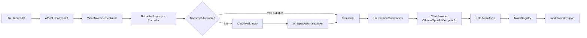
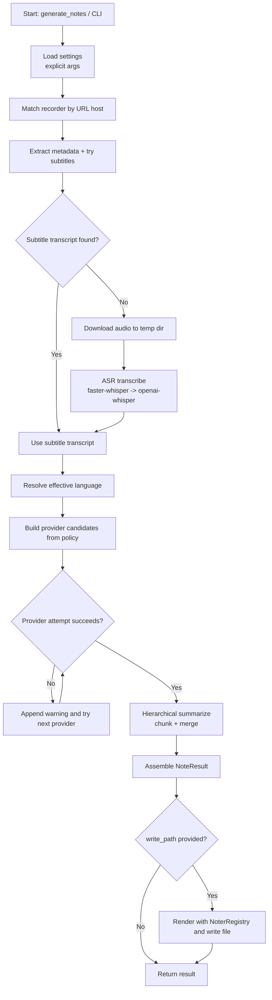

# silent Architecture and Video-to-Note Flow

## Scope

This document describes how `silent` turns a video URL into structured notes, the main module boundaries, and where fallback/retry logic lives.

## High-Level Architecture

`silent` is organized as a pipeline orchestrated by `VideoNotesOrchestrator`:

1. Input/API layer
2. Recording (metadata + subtitle transcript attempt)
3. ASR fallback transcription (if subtitles are unavailable)
4. Summarization (hierarchical chunk + merge)
5. Rendering/output formatting

Core entrypoints:

- Python API: `src/silent/api.py` (`generate_notes`)
- CLI: `src/silent/cli.py` (`silent ...`)
- Orchestrator: `src/silent/orchestrator.py` (`VideoNotesOrchestrator.generate`)

## Module Responsibilities

### Configuration

- File: `src/silent/orchestrator.py`
- Orchestrator validates explicit provider settings passed from API/CLI arguments.
- Logging config is provided explicitly via `configure_logging(...)` in `src/silent/logging.py`.

### URL Recording and Transcript Acquisition

- Files: `src/silent/recorders/*`
- `RecorderRegistry.match(url)` selects a recorder by domain:
  - `YouTubeRecorder` for YouTube URLs
  - `BilibiliRecorder` for Bilibili URLs
- `BaseRecorder.record(...)` extracts:
  - `VideoMetadata`
  - Subtitle transcript (if available)
  - Warnings
- Subtitle behavior:
  - Preferred language first (if explicitly set and not `auto`)
  - Subtitles before automatic captions
  - `vtt` format preferred
- If subtitle extraction fails, orchestrator calls `download_audio(...)` and falls back to ASR.

### Transcription

- Files: `src/silent/transcribers/*`
- Default transcriber: `WhisperASRTranscriber`
- Runtime fallback order inside ASR:
  1. `faster-whisper`
  2. `openai-whisper`
- Output is normalized into `Transcript(language, source, segments)`.

### Summarization

- Files: `src/silent/summarizers/*`
- Default summarizer: `HierarchicalSummarizer`
- Two-stage process:
  1. Chunk transcript via `TranscriptChunker`
  2. Summarize each chunk + merge chunk summaries into final Markdown
- Prompt generation lives in `PromptBuilder`.
- Timestamp inclusion policy (`section`, `point`, `none`) is encoded in merge prompt instructions.

### Model Providers

- Files: `src/silent/models/*`
- Shared provider interface: `ChatProvider.chat(...)`
- Concrete providers:
  - `OllamaProvider` (`local`)
  - `OpenAICompatibleProvider` (`online`)
- Orchestrator chooses provider attempt order via `provider_policy`:
  - `local_first`
  - `online_first`
  - `local_only`
  - `online_only`
- Provider failures raise `ProviderUnavailable`; orchestrator retries the next candidate and appends warnings.

### Output Rendering

- Files: `src/silent/noters/*`
- `NoterRegistry` maps output format to renderer:
  - `markdown` -> `MarkdownNoter`
  - `text` -> `TextNoter`
  - `json` -> `JsonNoter`
- If `write_path` is set, rendered output is written to disk.
- Returned object is always `NoteResult`.

## Data Model

Main shared dataclasses are in `src/silent/types.py`:

- `Segment`: `(start, end, text)`
- `Transcript`: `(language, source, segments)`
- `VideoMetadata`: `(url, title, duration_sec, platform)`
- `NoteResult`: final generated note + runtime metadata and warnings

## End-to-End Video-to-Note Flow

1. Caller invokes `generate_notes(...)` (API) or CLI.
2. API creates `VideoNotesOrchestrator` and calls `generate(...)`.
3. Orchestrator validates and uses explicit settings passed by caller.
4. Recorder is selected from `RecorderRegistry` based on URL host.
5. Recorder extracts metadata and tries subtitle transcript.
6. If no subtitles:
   - Recorder downloads audio to a temp directory.
   - Transcriber runs ASR and returns transcript.
   - Temp files are cleaned up in `finally`.
7. Orchestrator resolves effective language (`auto`/`None` uses transcript-detected language).
8. Orchestrator builds provider candidates from policy and configured models.
9. Summarizer runs against provider candidates in order:
   - Chunk-level summaries
   - Merge pass into final Markdown notes
10. On provider failure, warning is recorded and next provider is attempted.
11. On success, `NoteResult` is assembled.
12. If output path is requested, selected noter renders and writes output.
13. `NoteResult` is returned; CLI additionally prints selected format.

## Failure and Fallback Strategy

- Unsupported URL -> `UnsupportedURLError`
- Bad provider policy -> `ConfigurationError`
- Transcript extraction or ASR unavailable -> `TranscriptExtractionError`
- All model providers fail -> `ModelInferenceError`

Fallback ladders:

1. Transcript source: subtitles -> ASR
2. ASR backend: faster-whisper -> openai-whisper
3. LLM provider: according to `provider_policy` order

## Extension Points

To add new capabilities with minimal changes:

- New platform:
  - Implement `BaseRecorder.supports(...)`
  - Register in `default_recorder_registry()`
- New ASR engine:
  - Implement `BaseTranscriber`
  - Inject into `VideoNotesOrchestrator(...)`
- New summarization strategy:
  - Implement `BaseSummarizer`
  - Inject into orchestrator
- New model backend:
  - Implement `ChatProvider`
  - Add candidate wiring in orchestrator
- New output format:
  - Implement `BaseNoter`
  - Register in `default_noter_registry()`
